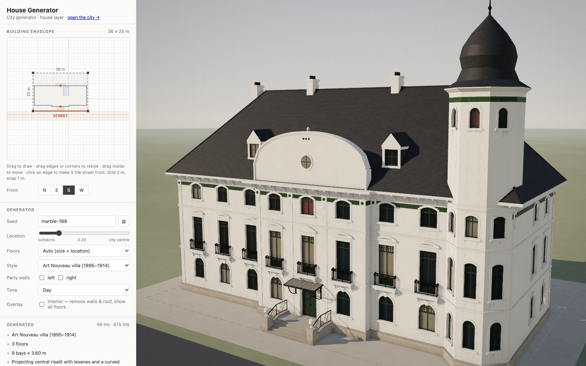
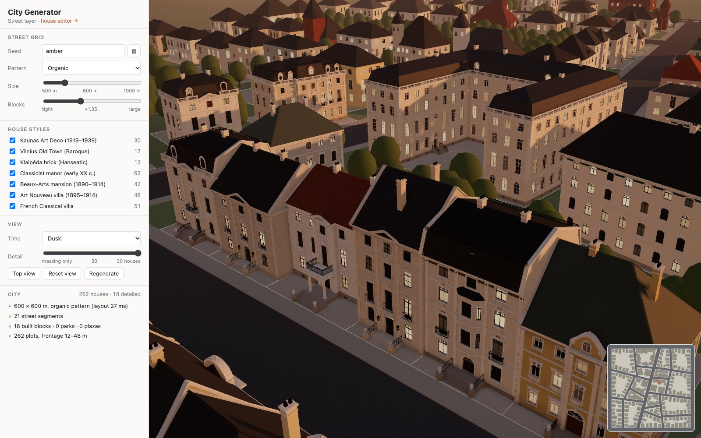

# citygen

Procedural 3D city generator in the browser: seeded, style-aware historic houses with interiors, from street grid to rooms.

**Live demo:** [zodele.lt/citygen](https://zodele.lt/citygen/) · [city view](https://zodele.lt/citygen/city.html)





## What it does

- **City layer**: organic or radial street grid, blocks, plots sized by distance to the centre, terraced rows in the core, parks in leftover land.
- **House layer**: draw a building envelope; the generator picks floors, bays, entrance, roof and façade detail. Seven styles: Kaunas Art Deco, Vilnius Old Town, Klaipėda brick, Classicist manor, Beaux-Arts, Art Nouveau, French Classical. Courtyard plans (U / closed) on deep plots, party walls for terraced houses.
- **Interior layer**: cellar, floors, attic and tower rooms; staircases; every room reachable by doors; flats in large houses.
- **Seeded and stable**: the same seed gives the same house; resizing keeps its character.
- Day / dusk / night lighting, weathering, camera and settings stored in the URL.
- Download the house (or its interior) as a 3D model (.glb) for Blender, game engines and viewers.

The engine (`packages/*`) is plain TypeScript with no DOM or renderer; the web app (`apps/web`) is a three.js viewer on top of it.

```
packages/core      seeded RNG, math, mesh builder
packages/city      street grid → plots
packages/house     plot → HouseSpec → mesh
packages/interior  HouseSpec → rooms, doors, stairs → mesh
apps/web           house editor (index.html) and city (city.html)
```

## Run

```sh
npm install
npm run dev      # http://localhost:5173  (city: /city.html)
npm test         # vitest
npm run build    # static site in apps/web/dist
```

Headless house generation:

```sh
npm run house -- --seed amber --width 30 --depth 20 --json
```

## Credits

Designed and directed by Tomas Liubinas. Built with Claude Opus 5.5 (Anthropic) in Claude Code.
